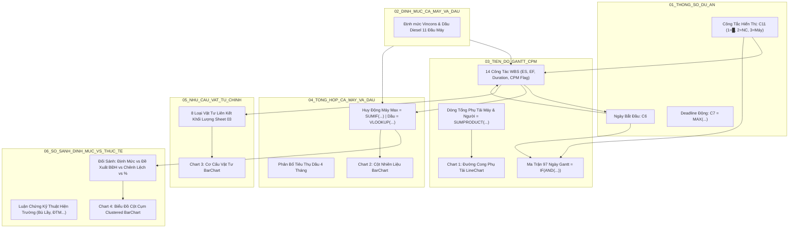
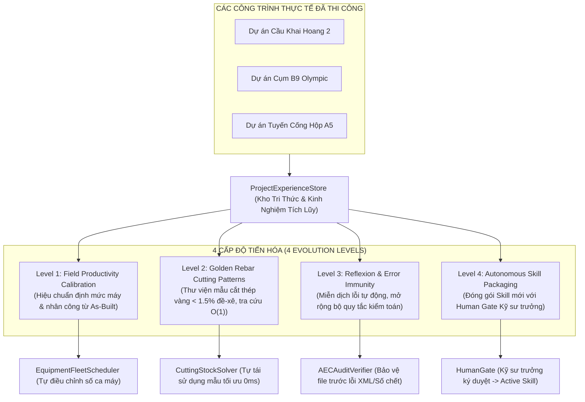

# 🏗️ 23HG-AEC-MultiAgent-System
### Bộ công cụ Python xác định (deterministic) cho kỹ thuật & quản lý thi công xây dựng — điều phối theo State Graph, có cổng chất lượng và cổng người duyệt

[](https://github.com/baotuhg/23HG-multiagent-system/actions/workflows/ci.yml)
[](https://www.python.org/)
[](LICENSE)
[](tools/cutting_stock_solver.py)

---

## 📖 1. Giới thiệu Tổng quan (Overview)

**23HG-AEC-MultiAgent-System** là bộ công cụ mã nguồn mở bằng Python, số hóa các khâu kỹ thuật lặp đi lặp lại trên công trường và ở phòng kế hoạch/QS: **tối ưu cắt thép 1D, dự toán `G_XD`, bảng thanh toán Mẫu 03a, tiến độ CPM, ca xe – ca máy – dầu diezel, kiểm tra phiếu thí nghiệm, và đóng gói hồ sơ Excel theo vai trò**.

### Hệ thống thực sự là gì
- **Pipeline điều phối xác định, không phải AI tự quyết.** Một `AECSupervisor` (state machine) gọi lần lượt các agent theo đồ thị trạng thái, kiểm tra Quality Gate sau mỗi pha, thử lại khi bị từ chối, và dừng ở **Human Gate** chờ kỹ sư phê duyệt. Mã nguồn **không gọi LLM hay API AI nào**; mọi phép tính (OR-Tools, CPM, G_XD, 03a…) là code Python thuần, kết quả lặp lại được.
- **Chỉ dùng dữ liệu thật theo mặc định.** Thiếu dữ liệu thì dừng và báo rõ cần cung cấp gì. Dữ liệu mẫu chỉ chạy với cờ `--demo` và luôn được đánh dấu trong log và báo cáo cuối.
- **Đọc được file thật:** BBS (Excel/CSV/JSON), tiến độ MS Project XML/Excel/CSV, bảng QS/BOQ, phiếu thí nghiệm, IFC (qua `ifcopenshell`), DXF (qua `ezdxf`).

### Những gì đã được kiểm chứng
- `python -m unittest discover -s tests -t .`: toàn bộ test tự động đạt (**227 unit tests đạt 100%**, gồm các phép tính tay độc lập cho tiền, đo bóc hình học mố trụ dầm cầu, kết cấu thép tấm, tối ưu cắt thép, tiến độ CPM, ca máy và hồ sơ mẫu); CI chạy trên Ubuntu (Python 3.10, 3.12) và Windows (Python 3.11).
- Chạy `--demo` đủ 8 pha (CAD → cắt thép → QS → QA/QC → Human Gate → CPM → ca máy → As-Built) không lỗi.
- Solver cắt thép tách theo từng Ø và mác thép, tính lưỡi cắt, báo **cận dưới** số cây (`OPTIMAL` nghĩa là đã chứng minh không dùng ít hơn được).
- Quét tĩnh các file Excel mẫu bằng `python -m tools.audit_excels_static <thư_mục>` (không cần Excel): không có mã lỗi công thức, không có tham chiếu tới sheet không tồn tại. Quality Gate khi xuất hồ sơ cũng kiểm tra điều này.
- Bộ tính công thức `tools/excel_eval.py` tính được **toàn bộ** ô công thức trong `examples/` và `templates/` (hơn 10.000 ô; gồm ngày tháng, `IF/AND`, `VLOOKUP`, `SUMPRODUCT` theo mảng, `TEXT`), không ô nào ra lỗi Excel. Đây vẫn là bộ tính tự viết, không phải Excel.

### Giới hạn cần biết trước khi dùng
- **Chưa thay thế kỹ sư.** Kết quả dự toán, thanh toán và hồ sơ nghiệm thu phải được kỹ sư QS/QLCL rà soát trước khi dùng cho hồ sơ pháp lý. Các căn cứ pháp lý và công thức nêu trong tài liệu là tham chiếu của tác giả, chưa qua thẩm định độc lập.
- **"Điểm Audit 100/100" do chính hệ thống tự chấm**, không phải đánh giá độc lập; các kiểm tra Excel ở đây là kiểm tra tĩnh, chưa đối chiếu bằng Microsoft Excel hay MS Project thật.
- **Một số phần mới ở mức nguyên mẫu:** Thuyết minh BPTC hiện là mẫu viết sẵn (chưa có RAG); So sánh phiên bản CAD mới đọc được dữ liệu cấu kiện/diện tích đa tuyến khép kín; chưa có giao diện Web/Mobile hay ký số.
- **Hồ sơ mẫu chưa hoàn chỉnh:** Cống A5 có 8/14 hồ sơ vi mô (6 sheet trong Master ghi "CHƯA LẬP"); số liệu đầu vào là số nhập, còn sai khác cốt thép +14,4% chờ kỹ sư QS — xem `examples/HO_SO_CONG_HOP_TUYEN_A5/README.md`. Các bản sao giữa các gói là chủ ý và được test kiểm tra không lệch nhau. Phần "Tự tiến hóa" (`aec_core/experience_store.py`) là kho kinh nghiệm hiệu chuẩn định mức/mẫu cắt thép, không phải học máy.

### Căn cứ tham chiếu (cần kỹ sư xác nhận khi áp dụng)
Luật Xây dựng 135/2025/QH15, NĐ 207/2026/NĐ-CP, NĐ 254/2025/NĐ-CP (thanh toán – Phụ lục 03a), TT 36/37/38/2026/TT-BXD (chi phí, đo bóc, định mức), TCVN 11823:2017, 5574:2018, 1651:2018, 9395:2012, 4453:1995; định mức ca máy và dầu theo bảng chuẩn Vincons trong `data/`.

### Giấy phép và ghi nhận tác giả
Phát hành theo **[MIT License](LICENSE)**. Tác giả & duy trì: **Nguyễn Bảo Tú** ([@baotuhg](https://github.com/baotuhg)). Kho chính thức: <https://github.com/baotuhg/23HG-multiagent-system>. Khi sao chép hoặc kế thừa, vui lòng giữ nguyên thông báo bản quyền và giấy phép MIT.

> 📘 **Tài liệu hữu ích cho người mới:** Xem ngay [Cẩm nang Hướng dẫn Viết Prompt & Câu Lệnh Thực Chiến](docs/HUONG_DAN_VIET_PROMPT.md) để biết cách ra lệnh chính xác cho AI và chạy các tác vụ kỹ thuật chuẩn xác.

---

## 🏛️ 2. Sơ đồ Kiến trúc Hệ thống (System Architecture)

Hệ thống hoạt động theo mô hình **Supervisor & Shared State Bus**: một state machine Python gọi các agent theo thứ tự, kiểm tra Quality Gate sau mỗi pha và dừng ở Human Gate chờ kỹ sư duyệt. Mọi phép tính là code Python xác định; hệ thống **không gọi LLM**.

```text
                           +-------------------------------+
                           |      BẢN VẼ / HỒ SƠ DỰ ÁN     |
                           |   (CAD / BIM / Yêu cầu KTXD)  |
                           +---------------+---------------+
                                           |
                                           v
                  +-------------------------------------------------+
                  |       SUPERVISOR (STATE MACHINE ĐIỀU PHỐI)      |
                  | - Tiếp nhận mục tiêu, phân bổ đầu việc Modular  |
                  | - Điều phối State dự án qua Shared State Bus    |
                  | - Kiểm soát các Cổng Chất lượng (Quality Gates) |
                  +-----------------------+-------------------------+
                                          |
        +---------------------------------+---------------------------------+
        |                                 |                                 |
        v                                 v                                 v
+------------------+             +------------------+             +------------------+
| CAD/BIM PARSER   |             | KỸ THUẬT BPTC    |             | QS DỰ TOÁN G_XD  |
| (Trắc đạc CAD)   |             | & KCS LAB LINK   |             | & PHỤ LỤC 03A    |
+--------+---------+             +--------+---------+             +--------+---------+
| * Đọc DWG/DXF    |             | * Kiểm soát BPTC |             | * Đơn giá TT 38/2026  |
| * Shoelace diện  |             | * Lab Link R7/R28|             | * Tính G_xd      |
|   tích, thể tích |             | * 22 BBNT chuẩn  |             | * Công thức Excel|
| * Average-End    |             | * Hold Points NT |             | * Phụ lục 03a    |
+--------+---------+             +--------+---------+             +--------+---------+
    |    |                                ^                                ^
    |    |                                |                                |
    |    v                                | (Phản biện vị trí nối thép)    | (BOM thép)
    |  +------------------+               | TCVN 5574: CẤM nối vùng kéo    |
    |  | CẮT THÉP 1D      +---------------+--------------------------------+
    |  | (OR-TOOLS SOLVER)|
    |  +------------------+
    |  | * Google OR-Tools| ---> Tối ưu số cây 11.7m theo từng Ø + mác thép
    |  | * CP-SAT / FFD   | ---> Kiểm tra chéo (Inter-Agent): REJECT nếu sai
    |  +--------+---------+
    |           |
    +-----------+
    |
    v
+---------------------------------------------------------------------------+
|                          LẬP TIẾN ĐỘ CPM & GANTT                          |
| * Sắp xếp Topo, Forward Pass (ES/EF) & Backward Pass (LS/LF), Total Float |
| * Nhận diện Đường găng (Critical Path Chain) & Xuất MS Project XML/MPP    |
+------------------------------------+--------------------------------------+
                                     |
                                     v
+---------------------------------------------------------------------------+
|             ĐIỀU PHỐI CA XE, CA MÁY & NHIÊN LIỆU DẦU DIEZEL               |
| * Tác tử Equipment Fleet Engine: Tính ca máy từ định mức Vincons / TT 37/2026   |
| * Phân bổ máy theo ngày/tuần, biểu đồ phụ tải & kế hoạch cấp phát dầu (L) |
+------------------------------------+--------------------------------------+
                                     |
                                     v
                  +-------------------------------------------------+
                  |       SHARED STATE BUS (SINGLE SOURCE OF TRUTH) |
                  |  9 Miền: Meta • CAD • Rebar • QS • QAQC • CPM   |
                  |     Fleet • As-Built • Human Approvals (RLock)  |
                  +------------------+------------------------------+
                                     |
            [Xung đột / Vi phạm?] ---+---> [Có] ---> REJECT / RETRY LOOP
                                     |               (Solver chạy lại hoặc
                                     |                BPTC điều chỉnh biện pháp)
                                   [Không]
                                     |
                                     v
                  +-------------------------------------------------+
                  |      HUMAN-IN-THE-LOOP QUALITY GATE             |
                  |  Trạng thái AWAITING_APPROVAL: Cảnh báo clash,  |
                  |  Kỹ sư trưởng / Giám đốc ký số phê duyệt        |
                  +------------------+------------------------------+
                                     |
                                     v
                  +-------------------------------------------------+
                  |      VÒNG LẶP ĐỐI SOÁT HIỆN TRƯỜNG (AS-BUILT)   |
                  |  Daily Site Log + Khối lượng thi công thực tế    |
                  |  -> Cập nhật CPM thực tế & Phát sinh Phụ lục 03a|
                  +------------------+------------------------------+
                                     |
                                     v
                  +-------------------------------------------------+
                  |    ĐÓNG GÓI PHÂN QUYỀN THỰC CHIẾN HUB & SPOKE   |
                  |  Gói A: Cơ giới & Dầu  | Gói B: Xưởng Thép CNC  |
                  |  Gói C: Hiện trường KCS| Gói D: QS & Dự toán    |
                  |  Gói E: Executive Hub  | DISPATCH_MANIFEST.json |
                  +-------------------------------------------------+
```

---

## 📥 3. Chuẩn I/O (Input/Output Specifications)

| Thành phần | Định dạng Đầu vào (Input) | Định dạng Đầu ra (Output) | Công cụ & Đặc tả Kỹ thuật |
|---|---|---|---|
| **Bóc tách CAD/BIM** | Bản vẽ CAD `.dwg`, `.dxf`, mô hình OpenBIM `.ifc` | Bảng khối lượng Bê tông, Ván khuôn, Cốt thép 3D, Đào đắp | `ifcopenshell` (ISO 16739), `ezdxf`, `AutoCAD COM`, Shoelace & IFC Qto |
| **Gia công Cốt thép** | File BBS thật `.xlsx` / `.csv` / `.json` (`--bbs`) | Phiếu cắt từng phương án cây 11.7m (CSV), số cây, cận dưới, đề-xê, mẩu thừa tận dụng | OR-Tools Column Generation (GLOP) + CP-SAT, tách nhóm Ø + mác thép, tính lưỡi cắt 3mm |
| **Dự toán Chi phí** | Khối lượng trích xuất, Đơn giá định mức | Bảng dự toán tổng hợp chi phí xây dựng `G_xd` | Excel có công thức; T và các tỷ lệ là ô đầu vào (`G_xd = T + GT + TL + VAT`) |
| **Thanh toán Hợp đồng**| Khối lượng thiết kế vs Khối lượng hoàn công | Bảng xác định khối lượng hoàn thành Phụ lục 03a | Nghị định 254/2025/NĐ-CP, tính phát sinh tự động |
| **Quản lý Tiến độ** | File tiến độ thật `MS Project .xml` / `.xlsx` / `.csv` (`--schedule`) | Bảng CPM (ES/EF/LS/LF, dự trữ, đường găng, ngày lịch) CSV; cảnh báo ngày trong file vi phạm quan hệ logic | CPM với quan hệ FS/SS/FF/SF + lag, lịch nghỉ (Chủ nhật, ngày lễ) |
| **Ca xe & Dầu Diezel** | Tiến độ CPM (`.xml`/`.xlsx`), Khối lượng hình học, Định mức ca máy | Bảng tiến độ ca máy theo ngày/tuần (`.xlsx` + `.xml`), Biểu đồ phụ tải, Kế hoạch cấp dầu Diezel (Lít) | `EquipmentFleetScheduler`, định mức Vincons / TT 37/2026, tính ca/ngày và nhiên liệu chi tiết |
| **Quản lý Chất lượng**| Phiếu thí nghiệm nén R7/R28, kéo thép, PDA | 22 Biên bản nghiệm thu KCS in ấn A4 chuẩn | Excel A4 Form (`MAU_BIEN_BAN_KCS`, thay thế hoàn toàn Word) |
| **Biện pháp Thi công** | Yêu cầu KTXD, điều kiện địa chất, thủy văn | Thuyết minh BPTC 8 chương TCVN | Markdown mẫu viết sẵn (Cầu Km19+529.080) — **RAG Hugging Face chưa triển khai**, xem lộ trình |
| **Đối soát Hiện trường**| Nhật ký thi công hàng ngày `DailySiteLog` | Báo cáo chênh lệch tiến độ & Chi phí phát sinh | As-Built Closed Loop, tự động cập nhật mạng CPM |
| **Đóng gói Hub & Spoke**| Toàn bộ dữ liệu & sản phẩm đầu ra dự án | 5 Gói vệ tinh độc lập (`GOI_A` đến `GOI_E`) kèm `DISPATCH_MANIFEST.json` | `AECPackageDispatcher`, phân quyền theo vai trò (RBAC), bảo mật giá thầu, chống khóa file |

---

## 🗺️ 4. Lộ trình Phát triển (Roadmap 3 Phase)

```text
  ĐÃ CÓ (có test tự động)
  ├── Cắt thép 1D: tối ưu số cây theo từng Ø + mác thép, có cận dưới chứng minh (OR-Tools GLOP + CP-SAT)
  ├── Tiến độ CPM: FS/SS/FF/SF + lag, lịch nghỉ; đọc MS Project XML / Excel / CSV
  ├── Dự toán G_XD và Mẫu 03a từ bảng QS thật; tiền tính bằng Decimal, làm tròn như ROUND của Excel
  ├── Ca xe, ca máy & kế hoạch dầu diezel (Gói A 5 sheet)
  ├── Supervisor (state machine) điều phối 8 pha, Quality Gate và Human Gate
  ├── Đóng gói Hub & Spoke 5 gói theo vai trò (tách file khi bàn giao; không mã hóa, không phân quyền truy cập)
  ├── Thư viện đo bóc có diễn giải (tools/takeoff_rules.py), xuất Bảng 6.1/6.2, nối vào pha CAD_TAKEOFF của Supervisor;
  │   quy tắc Phụ lục VI TT 13/2021 lấy từ bản OCR — CHƯA đối chiếu bản gốc
  └── Kiểm toán Excel tĩnh: mã lỗi, tham chiếu sheet không tồn tại, file rỗng, bản sao lệch nhau

  MỨC NGUYÊN MẪU / MỘT PHẦN
  ├── Kho kinh nghiệm dự án (hiệu chuẩn năng suất, thư viện mẫu cắt thép) — quy tắc cố định, không phải học máy
  ├── So sánh phiên bản CAD Rev00/Rev01 — so được dữ liệu cấu kiện; chưa tự bóc khối lượng từ bản vẽ
  ├── Vòng lặp hiện trường As-Built — mới chạy với dữ liệu mẫu
  └── Hồ sơ mẫu Cống A5: 8/14 hồ sơ vi mô có dữ liệu; cốt thép 03a lệch +14,4% so với bảng thống kê thép,
      đắp lưng cống tính lại chờ kỹ sư QS xác nhận (xem examples/HO_SO_CONG_HOP_TUYEN_A5/README.md)

  CHƯA LÀM
  ├── Đối chiếu với bảng dự toán thật đã duyệt (tests/golden/) và chạy thử trọn một công trình thật
  ├── Xác minh văn bản đo bóc áp dụng (thay đổi từ 01/07/2026 theo nguồn thứ cấp) và các số OCR của Phụ lục VI
  ├── RAG cho Thuyết minh BPTC (hiện là bản mẫu viết sẵn), ký số điện tử, quản lý nhiều dự án đồng thời
  └── Giao diện Web / Mobile cho kỹ sư hiện trường
```

---

## ⚡ 5. Hướng dẫn Cài đặt & Bắt đầu Nhanh (Quick Start)

### 1. Yêu cầu Hệ thống
- Hệ điều hành: Windows 10/11 (hỗ trợ tốt nhất cho AutoCAD COM Interop) hoặc Linux/macOS.
- Python: Phiên bản **3.10** trở lên.
- RAM: Tối thiểu 8 GB (khuyến nghị 16 GB khi xử lý file DWG lớn).

### 2. Cài đặt Môi trường
```powershell
# 1. Clone kho lưu trữ mã nguồn
git clone https://github.com/baotuhg/23HG-multiagent-system.git
cd 23HG-multiagent-system

# 2. Tạo và kích hoạt môi trường ảo Python (Virtual Environment)
python -m venv venv
.\venv\Scripts\activate       # Trên Windows PowerShell
# source venv/bin/activate    # Trên Linux/macOS

# 3. Cài đặt các gói phụ thuộc kỹ thuật
python -m pip install --upgrade pip
pip install -r requirements.txt
```

### 3. Các Lệnh Thực thi Chính

> ⚠ **Dữ liệu thật và dữ liệu mẫu:** mặc định hệ thống **chỉ dùng dữ liệu thật**. Pha nào thiếu dữ liệu sẽ dừng ngay và báo rõ cần cung cấp gì, không tự thay bằng số liệu mẫu. Dữ liệu mẫu (Cầu Km19+529.080) chỉ được dùng khi có cờ `--demo`, và mọi chỗ dùng đều được đánh dấu trong log, Quality Gate, Human Gate và báo cáo cuối.
>
> Hệ thống hỗ trợ thực thi độc lập từng pha chuyên sâu hoặc chạy toàn diện khép kín **8 pha**: CAD Takeoff $\rightarrow$ OR-Tools Rebar Cut $\rightarrow$ QS G_xd $\rightarrow$ QA/QC Lab Link $\rightarrow$ Human Gate $\rightarrow$ CPM Schedule $\rightarrow$ **Fleet Dispatch** $\rightarrow$ As-Built Loop.
>
> File Excel chỉ có công thức mà chưa từng được Excel tính (ví dụ file do phần mềm tạo ra) vẫn đọc được: `tools/excel_eval.py` tự tính các hàm thông dụng (SUM, SUMIF(S), COUNTIF(S), ROUND/ROUNDUP, tham chiếu sang sheet khác…). Gặp hàm chưa hỗ trợ thì hệ thống báo rõ, không đoán.

#### a. Tối ưu cắt thép từ BBS thật (dùng được cho dự án):
```powershell
python run_state_graph.py --phase rebar --bbs "BBS_du_an.xlsx" --cut-plan-out phieu_cat_thep.csv
```
> - Đọc được Excel (tự tìm sheet có bảng BBS, hoặc chỉ định `--bbs-sheet`), CSV (`,` `;` hoặc tab) và JSON. Cột nhận diện theo tiêu đề tiếng Việt hoặc tiếng Anh: *Ký hiệu thanh*, *Đường kính Ø (mm)*, *Mác thép*, *Chiều dài 1 thanh (m)* hoặc `length_mm`, *Tổng số thanh* hoặc *Số thanh / cấu kiện* × *Số cấu kiện*. Cột chiều dài bắt buộc ghi đơn vị (m hoặc mm).
> - Dòng BBS sai dữ liệu (đường kính không tiêu chuẩn, chiều dài quá ngắn, số lượng lẻ...) làm hệ thống **dừng và liệt kê từng dòng**. Nếu muốn loại các dòng đó và tiếp tục, thêm `--bbs-skip-invalid`; các dòng bị loại vẫn được cảnh báo.
> - Solver chỉ ghép các đoạn **cùng đường kính và cùng mác thép**, trừ 3mm lưỡi cắt mỗi nhát, rồi báo **cận dưới** số cây. `OPTIMAL` nghĩa là đã chứng minh không thể dùng ít cây hơn. Nếu đề-xê vẫn > 1.5% thì đó là do chiều dài thanh trong BBS, không phải do cách ghép.
> - **Thanh dài hơn 11.7m** được tự tách thành k đoạn nối (vd 39.85m thành 4 đoạn, 3 mối nối), nếu có vùng cho phép nối (cột *Vùng cho phép nối* hoặc `--splice-zone`):
>   - Mỗi đoạn ≤ cây thép và ≥ max(L nối, 20D). Mọi vùng chồng nối nằm trong vùng cho phép.
>   - **Mối nối so le theo từng dòng BBS:** tâm các mối nối cách nhau < 1.3 × L_nối coi là cùng mặt cắt, và mỗi mặt cắt có tối đa `--max-splice-ratio` (mặc định 50%) số thanh có mối nối.
>   - Cách tách được tối ưu cùng lúc với phần cắt các thanh khác, ưu tiên đoạn dài đúng 11.7m để dùng trọn cây.
>   - Thanh không có vùng nối, hoặc không bố trí được mối nối trong vùng cho phép, được liệt kê là **CHƯA có trong kế hoạch cắt**.
> - Cáp DƯL không cắt từ cây thép và được cảnh báo riêng. Vị trí nối phải đối chiếu với bản vẽ (`NOT_RUN` ở Gate-2).
> - **Giới hạn cho tổ cắt:** `--max-pieces-per-bar 4 --max-marks-per-bar 2`. **Cắt đầu cây:** `--end-trim-mm 50`. **Lưỡi cắt:** `--kerf-mm 3`. **Đầu thừa** được phân loại *Tái sử dụng* (≥ 100D, đổi bằng `--reuse-xd`), *Đầu thừa ngắn* (≥ 20D) hoặc *Phế*.
> - **Phương án nối thép tận dụng đầu thừa** (`--splice`), đưa phép nối vào ngay mô hình tối ưu OR-Tools, chặt hơn PA4 của RebarCut.
> - **Xuất theo bố cục RebarCut Pro Excel:** `--rebarcut-out ket_qua.xlsx`, gồm các sheet INPUT, SO_SANH, PA_TOI_UU, PA_NOI, MOI_NOI, REMAIN, CHI_TIET.

#### a2. Tính tiến độ CPM từ file tiến độ thật:
```powershell
python run_state_graph.py --phase schedule --schedule "TienDo.xml" --non-working-days cn --holidays 2027-02-05:2027-02-12 --schedule-out tien_do_cpm.csv
```
> - Đọc được **MS Project XML** (File → Save As → XML trong MS Project), Excel, CSV hoặc JSON. Cột nhận diện theo tiêu đề: *Mã WBS*, *Danh mục công tác*, *Thời gian (ngày)*, *Quan hệ logic* (vd `1.2FS; 1.3SS+3d`), *Ngày bắt đầu/hoàn thành* (tùy chọn, dùng để đối chiếu).
> - Hỗ trợ quan hệ **FS / SS / FF / SF** có độ trễ (âm hoặc dương), ngày nghỉ trong tuần (`--non-working-days t7,cn`) và ngày lễ (`--holidays`). Ngày khởi công lấy từ file, hoặc chỉ định bằng `--start-date`.
> - Liên kết tới công việc không tồn tại, vòng lặp logic, thời lượng sai: **dừng và liệt kê từng lỗi**.

#### a3. Tính dự toán G_XD từ bảng QS thật:
```powershell
python run_state_graph.py --phase qs --qs "Du_toan.xlsx" --qs-out du_toan_gxd.xlsx
```
> - Đọc bảng QS / BOQ (Excel `.xlsx`/`.xls`, CSV hoặc JSON) theo các cột *STT*, *Mã hiệu*, *Nội dung công tác* (hoặc *Danh mục công tác*), *ĐVT*, *Khối lượng*, *Đơn giá* (hoặc *Đơn giá vật liệu / nhân công / máy*), *Thành tiền*. Tiêu đề 2 dòng kiểu phần mềm dự toán ("Đơn giá" ở trên, "Vật liệu / Nhân công / Máy thi công" ở dưới) được ghép tự động.
> - `T = Σ khối lượng × đơn giá`. `GT = T × (chi phí chung + nhà tạm + công việc không xác định KL)`, `TL = (T + GT) × tỷ lệ`, `G = T + GT + TL`, `G_XD = G + VAT` (TT 36/2026/TT-BXD).
> - **Tỷ lệ** được đọc từ sheet tổng hợp G_XD trong file, hoặc truyền bằng `--rate-chung --rate-nha-tam --rate-kxd --rate-tl --vat` (đơn vị %).
> - Bảng tách đơn giá *Vật liệu / Nhân công / Máy* được làm tròn từng thành phần từng dòng rồi cộng (đúng cách phần mềm dự toán tính `T = VL + NC + M`). Một sheet chứa nhiều **hạng mục** (dòng `HẠNG MỤC: ...`) được tách riêng; mỗi hạng mục tính độc lập.
> - Đã kiểm bằng một dự toán xây lắp thật (2 hạng mục, 425 công tác, TT 13/2021/TT-BXD): khớp từng khoản `VL/NC/M/T/C/LT/TT/TL/G/G_XD` đến từng đồng (golden test `tests/test_qs_construction.py`).

#### a3b. Tính lại dự toán khảo sát xây dựng và đối chiếu với file:
```powershell
python run_state_graph.py --survey "Du_toan_khao_sat.xls"
```
> - Bảng khối lượng × đơn giá tách *Vật liệu / Nhân công / Máy*; tỷ lệ đọc từ bảng tổng hợp có ký hiệu `C`, `TL`, `Gks`, `Glpa`, `Glbc`, `Gco`, `Gdc`, `Ggt`, `Gbh`, `GTGT`, `Gdp` (cột CÁCH TÍNH, vd `NC x 65%`), đối chiếu thêm với sheet *Hệ số* nếu có. Thiếu tỷ lệ nào thì báo, không tự điền.
> - `C = NC × %`, `TL = (T + C) × %`, `Gks = T + C + TL`, `G = Gks + Glpa + Glbc + Ghmc`, `Gxd = G + GTGT`, tổng = `Gxd + Gdp`. Mọi giá trị ghi trong file được tính lại và báo lệch nếu khác quá 1 đồng.
> - Đã kiểm bằng một dự toán khảo sát thật đã thẩm định: khớp đến từng đồng (golden test `tests/test_survey_estimate.py`).

#### a3c. Quy ước tính thép & đài móng (chuẩn hóa từ bảng tính QS chuyên nghiệp):
> - `tools/steel_qs.py` — quy ước cốt thép & kết cấu thép: khối lượng đơn vị `D²/162` (kg/m); cây 11,7 m chỉ đếm cho D > 8 (D ≤ 8 cấp dạng cuộn); số cây `= ROUND(kg / kg một cây)`; dây buộc 1,5%; thép tấm `PL` = `t·rộng·dài·7,85/10⁶`, thép hình = `kg/m · dài`. Engine cầu dùng chung quy ước này.
> - `tools/civil_foundation_qs.py` — đo bóc đài móng (bê tông, bê tông lót, ván khuôn): đài vuông/chữ nhật, chóp cụt (công thức xấp xỉ trung bình diện tích theo QS), quả trám kiểu 1; kèm quy ước số cạnh ván khuôn vách (`WALL_FORMWORK_FACES`).
> - Cả hai đã kiểm bằng các ô đã tính sẵn trong hồ sơ QS thật: khớp đến từng m³/kg (golden test `tests/test_steel_qs_golden.py`, `tests/test_civil_foundation_qs_golden.py`).

#### a4. Lập Mẫu 03a — giá trị khối lượng hoàn thành đề nghị thanh toán (NĐ 254/2025):
```powershell
python run_state_graph.py --phase payment --qs "Du_toan.xlsx" --progress "KL_ky_01.xlsx" --price-basis direct --advance-recovery-pct 20 --retention-pct 5 --period 01 --payment-out Mau_03a_ky01.xlsx
```
> - **Hợp đồng** (khối lượng, đơn giá) lấy từ bảng QS. **Khối lượng thực hiện** lấy từ file `--progress`.
> - Tự động tính khấu trừ thu hồi tạm ứng, khấu trừ bảo hành, phát hiện và cảnh báo khối lượng vượt hợp đồng tại sheet `PHAT_SINH_CANH_BAO`.

#### a4b. Đánh giá phiếu thí nghiệm & điểm dừng kỹ thuật (Hold Point) từ file thật:
```powershell
python run_state_graph.py --phase qaqc --lab "Phieu_thi_nghiem.xlsx" --lab-out danh_gia_thi_nghiem.xlsx
```
> - Đọc phiếu thí nghiệm (Excel, CSV hoặc JSON; mẫu cột: `templates/Phieu_thi_nghiem_mau.csv`): nén bê tông R7/R28, kéo thép, PDA, siêu âm cọc, độ sụt...
> - Mỗi phiếu được đánh giá **ĐẠT / KHÔNG ĐẠT / CHỜ**; mỗi biên bản nghiệm thu (BBNT) liên kết được xếp **GIẢI TỎA / CHỜ / CHẶN**. Có phiếu KHÔNG ĐẠT thì phase dừng.
> - Kiểm toán Excel master (GATE-4, điểm do hệ thống tự chấm) chỉ chạy khi có `--excel`; không có thì Human Gate ghi rõ "chưa kiểm toán".

#### a4c. Kiểm tra file đầu vào trước khi chạy (không tính toán, không ghi file):
```powershell
python run_state_graph.py --check-inputs --bbs "BBS.xlsx" --qs "Du_toan.xlsx" --schedule "TienDo.xml" --lab "Phieu_thi_nghiem.xlsx"
```
> Đọc từng file bằng đúng bộ đọc của hệ thống, liệt kê dòng lỗi, trả mã thoát 1 nếu có lỗi — dùng được trong script / CI.

#### a4d. Đo bóc khối lượng từ bảng cấu kiện → Bảng 6.2 / 6.1:
```powershell
python run_state_graph.py --takeoff "cau_kien.csv" --takeoff-out bang_khoi_luong.xlsx --takeoff-profile tt13-2021
```
> - Mỗi dòng là một cấu kiện: `be_tong`, `van_khuon` (kiểu `mong/cot/dam/san/tuong`), `coc_khoan_nhoi`, `khoan`, `cot_tron`, `dao_hao`, `dao_ho`, `mat_cat` (nhiều dòng cùng tên = các mặt cắt), `ong`, `dan_giao_trong`, `dan_giao_cot`. Mẫu cột: [`templates/Mau_dau_vao_do_boc.csv`](templates/Mau_dau_vao_do_boc.csv).
> - Kết quả: sheet `BANG_6_2_CHI_TIET` (có diễn giải tính toán từng dòng), `BANG_6_1_TONG_HOP` và `QUY_TAC_DO_BOC` (hồ sơ quy tắc đã dùng, kèm cảnh báo nếu chưa đối chiếu bản gốc).
> - `--takeoff-profile`: `mac-dinh` (trừ mọi lỗ rỗng ghi trong bản vẽ), `tt13-2021` (ngưỡng lấy từ bản OCR Phụ lục VI — **chưa đối chiếu bản gốc**) hoặc đường dẫn file JSON do kỹ sư QS lập.
> - Dòng sai dữ liệu (thiếu kích thước, loại không hợp lệ, số âm) làm lệnh **dừng và liệt kê từng dòng**, mã thoát 1.
> - **Chạy qua Supervisor:** thêm `--phase takeoff` (hoặc `--demo` để chạy đủ 8 pha) thì bảng cấu kiện đi vào pha CAD_TAKEOFF: kết quả nằm trong State Bus (`cad_data.takeoff_quantities`, có diễn giải từng dòng), qua Gate-1 (cảnh báo nếu hồ sơ quy tắc chưa đối chiếu bản gốc) và hiện ở Human Gate. Ví dụ:
>   `python run_state_graph.py --takeoff cau_kien.csv --phase takeoff rebar qs --takeoff-profile tt13-2021`

#### a5. Điều phối Ca xe, Ca máy & Kế hoạch Nhiên liệu Dầu Diezel:
```powershell
python run_state_graph.py --phase fleet --fleet-out ca_xe_ca_may.xlsx --shifts 2
```
> - Tự động bóc tách ca máy từ khối lượng công tác và tiến độ CPM theo định mức ca máy Vincons / Thông tư 37/2026/TT-BXD.
> - Xuất bảng tiến độ ca máy chi tiết theo ngày/tuần, biểu đồ phụ tải máy móc và bảng dự trù cấp phát nhiên liệu dầu Diezel (Lít) theo từng ca làm việc.

#### a6. Xuất Hồ Sơ Công Nghiệp 3 Tầng & Đóng Gói Hub & Spoke (Industrial End-to-End Export Pipeline):
```powershell
# 1. Xuất trọn vẹn 3 Tầng hồ sơ công nghiệp cho dự án bất kỳ từ Master Workbook (kèm Quality Gate kiểm tra lỗi công thức):
python run_state_graph.py --export-all --excel "Du_An_Master.xlsx" --export-dir "./HO_SO_XUAT_XUONG" --project-name "Cầu Km19+529.080"

# 2. Xuất trực tiếp qua module Package Dispatcher độc lập:
python -m tools.package_dispatcher --master "Du_An_Master.xlsx" --target "./HO_SO_XUAT_XUONG" --project-name "Cầu Km19+529.080"

# 3. Hoặc đóng gói theo thư mục nguồn (chế độ site operation):
python -m tools.package_dispatcher --source ./examples/HO_SO_CONG_HOP_TUYEN_A5 --target ./HO_SO_HUB_AND_SPOKE
```
> - **Tự động sản xuất đồng bộ 3 tầng đóng gói**:
>   1. **Tầng 1 (Macro Master)**: `BO_HO_SO_01_MACRO_MASTER_14_SHEET` (Master, XML/MPP, BBNT Word, báo cáo kiểm toán tự chấm).
>   2. **Tầng 2 (Micro 14 bộ)**: `BO_HO_SO_02_VI_MO_CHUYEN_SAU_14_BO` (tối đa 14 file độc lập; công thức trỏ sang sheet không có trong file được thay bằng giá trị đã tính; sheet chưa có dữ liệu không được xuất).
>   3. **Tầng 3 (Hub & Spoke 5 gói)**: `03_HO_SO_THUC_CHIEN_HUB_AND_SPOKE_5_GOI_VE_TINH` (Tách file theo vai trò — không mã hóa hay phân quyền truy cập, Gói A **bắt buộc tuân thủ chuẩn 5 sheets Vincons / 23HG System**, Bảng phân quyền bàn giao, file `DISPATCH_MANIFEST.json` xác thực mã băm MD5).
> - **Cổng kiểm toán tự động (Quality Gate)**: Quét mọi file Excel đã sinh, báo lỗi nếu có mã lỗi công thức (`#REF!`, `#VALUE!`, `#DIV/0!`, `#N/A`...) hoặc công thức trỏ tới sheet không tồn tại; kết quả ghi vào `DISPATCH_MANIFEST.json`. Đây là kiểm tra tĩnh, không thay cho việc mở bằng Excel.

#### b. Chạy thử toàn bộ 8 pha bằng dữ liệu mẫu (demo):
```powershell
python run_state_graph.py --demo
```
> Vòng lặp tự động tuần tự qua 8 pha: `CAD Takeoff` $\rightarrow$ `OR-Tools Rebar Cut` $\rightarrow$ `QS G_xd` $\rightarrow$ `QA/QC Lab Link` $\rightarrow$ `Human Gate` $\rightarrow$ `CPM Schedule` $\rightarrow$ `Fleet Dispatch` $\rightarrow$ `As-Built Loop`. Ở chế độ demo, Human Gate mặc định tự phê duyệt (`auto`). Khi chạy không có `--demo`, Human Gate dừng lại chờ Kỹ sư trưởng phê duyệt `[A] Approve` / `[R] Reject`.

#### c. Kiểm tra Solver Cắt thép OR-Tools & Bộ tính Tiến độ CPM:
```powershell
python run_state_graph.py --solver-test
```

> **Trạng thái runtime** (khôi phục sau khi dừng giữa chừng) được ghi vào `.aec_state/RUNTIME_STATE.json` — thư mục này không đưa vào git. Đổi vị trí bằng biến môi trường `AEC_STATE_DIR`.

#### c2. Chạy bộ kiểm thử tự động toàn diện (Unit Tests):
```powershell
# Chạy toàn bộ test suite
python -m unittest discover tests

# Hoặc kiểm tra riêng module ca máy và phân gói Hub & Spoke
python -m unittest tests/test_equipment_fleet_scheduler.py tests/test_package_dispatcher.py
```

#### d. Thử nghiệm So sánh Phiên bản Bản vẽ CAD (Incremental Diff Rev00 vs Rev01):
```powershell
python examples/run_cad_diff_demo.py
```

#### e. Chạy Kiểm toán Độc lập trên Workbook 14 Sheet Master (điểm tự chấm):
```powershell
python examples/run_pipeline.py
```

---

## 🏆 6. Chuẩn Đóng Gói Hồ Sơ: Từ Macro/Micro đến Mô hình Thực chiến "Hub & Spoke" Phân Quyền 5 Gói

Hệ thống thiết lập **3 Tầng Đóng Gói Hồ Sơ Linh Hoạt**, đáp ứng trọn vẹn từ yêu cầu thẩm định vĩ mô của Chủ đầu tư đến nhu cầu thi công, gia công thực chiến tại hiện trường:

```
                            +-------------------------------------+
                            |        CENTRAL STATE BUS / DB       |
                            |       "Single Source of Truth"      |
                            +------------------+------------------+
                                               |
             +---------------------------------+---------------------------------+
             |                                 |                                 |
             v                                 v                                 v
+------------------------+        +------------------------+        +------------------------+
| GÓI A: CƠ GIỚI & DẦU   |        | GÓI B: XƯỞNG CỐT THÉP  |        | GÓI C: HIỆN TRƯỜNG KCS |
| • Quản lý máy móc      |        | • Quản đốc xưởng       |        | • Cán bộ QA/QC, TVGS   |
| • Cấp phát Dầu Diezel  |        | • Lệnh cắt CNC (.csv)  |        | • BBNT Word A4 (.docx) |
| • Biểu đồ phụ tải máy  |        | • Sơ đồ 1D CSP 11.7m   |        | • Ma trận nén R7/R28   |
+------------------------+        +------------------------+        +------------------------+
             |                                 |                                 |
             +---------------------------------+---------------------------------+
                                               |
                                               v
                            +-------------------------------------+
                            | GÓI D: QS, DỰ TOÁN & THANH TOÁN     |
                            | • Kỹ sư QS, Kế toán dự án           |
                            | • Bảo mật đơn giá dự toán G_XD      |
                            | • Bảng thanh toán Phụ lục 03a       |
                            +------------------+------------------+
                                               |
                                               v
                            +-------------------------------------+
                            | GÓI E: EXECUTIVE DASHBOARD (HUB)    |
                            | • Giám đốc Dự án, Ban QLDA, CĐT     |
                            | • Tiến độ CPM, báo cáo kiểm toán    |
                            +-------------------------------------+
```

### 1. TẦNG 1: VĨ MÔ / MASTER 14 SHEET (Macro Tier)
*Mục đích: Phục vụ Hội đồng Thẩm định, Lưu trữ Pháp lý, Kiểm toán Độc lập.*
- **Tệp Excel Master:** [`templates/Ho_So_KCS_QS_TienDo_Cau_Khai_Hoang_2_Km14+363.65.xlsx`](templates/Ho_So_KCS_QS_TienDo_Cau_Khai_Hoang_2_Km14+363.65.xlsx) gồm **14 Sheet** liên kết bằng công thức (điểm audit do hệ thống tự chấm, chưa kiểm định độc lập).
- **Tệp Tiến độ MS Project:** [`templates/Tien_Do_Thi_Cong_Cau_Khai_Hoang_2.xml`](templates/Tien_Do_Thi_Cong_Cau_Khai_Hoang_2.xml) & [`.mpp`](templates/Tien_Do_Thi_Cong_Cau_Khai_Hoang_2.mpp).
- **Báo cáo kiểm toán (tự chấm):** [`templates/BAO_CAO_THAM_TRA_AEC_AUDIT_KHAI_HOANG_2.md`](templates/BAO_CAO_THAM_TRA_AEC_AUDIT_KHAI_HOANG_2.md).

### 2. TẦNG 2: VI MÔ / TỐI ĐA 14 HỒ SƠ ĐỘC LẬP (Micro Tier 1-to-1)
*Mục đích: Cho phép chuyên viên kỹ thuật tra cứu chuyên sâu từng hạng mục mà không làm gãy công thức `#REF!`.*
- Mỗi Sheet trong Master được tách thành 1 file độc lập (`01_To_Hop_Cat_Thep_11m7_RebarCut.xlsx`, `02_Khoi_Luong_Dao_Dap_Trinh_Dien.xlsx`... đến `14_Mau_A4_Bien_Ban_Lay_Mau_Thi_Nghiem_R7_R28.xlsx`), chứa sẵn các tab dữ liệu nội bộ (`DATA_CONG_TAC`, `DATA_VAT_LIEU`, `DATA_NEN_MAU`).
- Lệnh tự động dựng: `python examples/build_14_micro_standalone_dossiers.py`.
- Sheet chưa có dữ liệu trong Master không được xuất thành file (hồ sơ mẫu Cống A5 hiện có 8 hồ sơ vi mô).

### 3. TẦNG 3: MÔ HÌNH THỰC CHIẾN "HUB & SPOKE" PHÂN QUYỀN 5 GÓI (Role-Based Field Dispatching)
*Mục đích: KHUYẾN NGHỊ HÀNG ĐẦU CHO ĐIỀU HÀNH CÔNG TRƯỜNG THỰC TẾ.*
Giảm 3 nhược điểm khi dùng 1 file 14 sheet trên hiện trường:
1. **Xung đột file khóa (Read-Only Lock):** Nhiều bộ phận (QS, Đội xe, Thợ sắt, QA/QC) cùng mở và chỉnh sửa không bị tranh chấp tệp.
2. **Tách dữ liệu tài chính khỏi gói hiện trường** (tách file khi bàn giao — không mã hóa, không phân quyền truy cập; ai có file vẫn mở được): Thợ sắt, lái máy và thầu phụ chỉ nhận đúng thông số kỹ thuật, **không thấy đơn giá thầu, chi phí gián tiếp hay lợi nhuận định mức** của Tổng thầu.
3. **Tối ưu hóa thiết bị di động:** Dung lượng file nhẹ, mở tức thì trên điện thoại ngoài công trường, không lo lag hay gãy công thức.

#### Bảng Phân Quyền & Bàn Giao 5 Gói Vệ Tinh:
| Gói hồ sơ | Đối tượng sử dụng | Quyền hạn dữ liệu | Tệp bàn giao chính |
| :--- | :--- | :--- | :--- |
| **Gói A: Cơ giới & Dầu** | Đội trưởng xe máy, Thủ kho dầu, Lái xe máy | Xem tiến độ ca máy, phụ tải, ký nhận dầu. **Không xem đơn giá tiền.** | `260920_TDTC_CaXe_CaMay_...xlsx`<br>`260920_Tien_Do_CaMay_...xml` |
| **Gói B: Xưởng cốt thép** | Quản đốc xưởng, Thợ uốn cắt, Nhà cấp thép | Xem BBS, sơ đồ cắt thép, file CSV nạp máy CNC. **Không xem đơn giá tiền.** | `01_To_Hop_Cat_Thep_11m7_RebarCut.xlsx`<br>`01_Phieu_Cat_Thep_Xuong_CNC_...csv`<br>`04_Thong_Ke_Thep_Chi_Tiet_BBS_...xlsx` |
| **Gói C: Hiện trường KCS** | Kỹ sư QA/QC, Tư vấn giám sát, Thí nghiệm | Xem ngày nghiệm thu, nén mẫu, in ấn biên bản. **Không xem đơn giá tiền.** | `11_Danh_Muc_KCS_Bien_Ban_Nghiem_Thu.xlsx`<br>`Ho_So_Bien_Ban_Nghiem_Thu_KCS_...docx`<br>`Mau_A4_Bien_Ban_...xlsx` |
| **Gói D: QS & Dự toán** | Kỹ sư QS, Trưởng phòng Kế hoạch, Kế toán | **Toàn quyền xem đơn giá, doanh thu, thanh toán.** | `03_QS_Dien_Giai_Chi_Tiet_Takeoff.xlsx`<br>`08_Du_Toan_GXD_Thong_Tu_11_2021.xlsx`<br>`09_Thanh_Toan_Khoi_Luong_Phu_Luc_03a.xlsx` |
| **Gói E: Executive Hub** | Giám đốc Dự án, Ban Giám đốc, Chủ đầu tư | Xem KPI tổng thể, tiến độ đường găng CPM, báo cáo kiểm toán tự chấm. | `02_Tien_Do_Thi_Cong_Master_...xml`<br>`03_BAO_CAO_THAM_TRA_AEC_AUDIT_...md` |

> [!CAUTION]
> **TIÊU CHUẨN CỐT LÕI BẤT DI BẤT DỊCH CHO GÓI A (CƠ GIỚI & DẦU):**  
> Mọi dự án khi xuất hồ sơ Gói A bắt buộc phải tuân thủ nghiêm ngặt **CẤU TRÚC 5 SHEETS CHUẨN MẪU VINCONS / 23HG SYSTEM**:
> - **Sheet 1 — `01_TienDo_CaMay_Master`**: Lưới dải ngày chi tiết (ngày, thứ, Chủ nhật đỏ), số máy huy động thực tế/ngày, **Summary 1** Tổng nhân công/ngày, **Summary 2** Ca máy từng loại theo ngày, **Summary 3** Tổng lít dầu Diezel tiêu thụ hàng ngày bằng công thức sống `=SUM(...)`.
> - **Sheet 2 — `02_TongHop_CaXe_CaMay_MMTB`**: Bảng tổng hợp ca xe máy MMTB, ĐM dầu (lít/ca), Tổng số ca máy, Số máy Max, Số ngày, Tổng lít dầu tiêu thụ `=F*E`.
> - **Sheet 3 — `03_KeHoach_Dau_Diezel`**: Kế hoạch cấp dầu Diezel phân bổ khoa học theo 4 Kỳ thi công chiến lược.
> - **Sheet 4 — `04_KeHoach_NhanLuc`**: Bảng phân bổ nhân lực theo từng tổ đội thi công chuyên nghiệp.
> - **Sheet 5 — `05_DoiChieu_BocTach`**: Bảng đối chiếu khối lượng thực tế hồ sơ bóc tách thiết kế.
> - **File XML MS Project**: Xuất tệp `.xml` theo định dạng Microsoft Project XML.

> Chi tiết quy trình đóng gói: Xem [`workflows/15_QUY_TRINH_DONG_GOI_HUB_AND_SPOKE_PHAN_QUYEN_THUC_CHIEN.md`](workflows/15_QUY_TRINH_DONG_GOI_HUB_AND_SPOKE_PHAN_QUYEN_THUC_CHIEN.md).  
> Các bộ hồ sơ mẫu thực chiến chuẩn 5 gói Hub & Spoke:
> - **Cống hộp Tuyến A5**: [`examples/HO_SO_CONG_HOP_TUYEN_A5/HO_SO_THUC_CHIEN_HUB_AND_SPOKE_CONG_A5/`](examples/HO_SO_CONG_HOP_TUYEN_A5/HO_SO_THUC_CHIEN_HUB_AND_SPOKE_CONG_A5/)
> - **Cầu Km19+529.080 (3 Nhịp Super-T)**: Được sinh tự động qua [`examples/build_km19_529_hub_and_spoke_packages.py`](examples/build_km19_529_hub_and_spoke_packages.py) & [`examples/generate_km19_machine_schedule.py`](examples/generate_km19_machine_schedule.py).


---

## 📈 7. Động cơ Tiến độ CPM bằng Công thức Excel & Biểu đồ Native (Dynamic Schedule & Fleet Engine)

Hệ thống bổ sung công cụ chuyên biệt **`DynamicScheduleBuilder`** ([`tools/dynamic_schedule_builder.py`](tools/dynamic_schedule_builder.py)), giảm "số chết", lỗi đứt gãy công thức `#REF!` và dung lượng lớn của các file tiến độ truyền thống:



### 1. Bảng So Sánh Kỹ Thuật: Bản Gốc Vina Alpha vs Bản Tinh Giản Chuẩn CPM Mới
| Tiêu chí kỹ thuật | File gốc Vina Alpha (`260820_TĐTC cụm B9.xlsx`) | Bản Tinh Giản Chuẩn CPM (`260820_TDTC_Cum_B9_TINH_GIAN_CHUAN_CPM.xlsx`) |
| :--- | :--- | :--- |
| **Dung lượng tệp (File Size)** | **13.9 MB** (Cực kỳ nặng, mở mất 15-30 giây) | **41.6 KB** (nhẹ hơn khoảng 330 lần) |
| **Rác Defined Names** | **28.091 name rác ẩn** (18.635 name bị gãy `#REF!`) | **0 name rác** |
| **Tính toàn vẹn XML** | Dễ crash, báo lỗi phục hồi khi mở trên Excel | Mở bằng Excel không báo phục hồi (tác giả kiểm tra bằng Excel COM) |
| **Cơ chế số liệu** | Nhiều số gõ chết (dead numbers), đứt gãy liên kết | **Công thức liên kết**: Đổi ngày bắt đầu `C6` tại Sheet 01, toàn bộ 14 công tác, 97 cột Gantt, phụ tải và 4 biểu đồ tự nhảy theo |
| **Công tắc hiển thị Gantt** | Cố định, không thể đổi chế độ xem | **Tương tác động qua ô `C11`**: Nhập `1` (Hiện vạch tiến độ `█`), nhập `2` (Hiện số nhân công/ngày), nhập `3` (Hiện số ca máy/ngày) |
| **Phục hồi Sheet SS** | Bị lỗi gãy tham chiếu `#REF!`, số liệu chết | **Sheet 06 hoàn chỉnh**: Đối sánh chi tiết Định mức vs Đề xuất BĐH, phân tích lý do chênh lệch kỹ thuật và cân bằng dầu Diesel |
| **Hệ thống Biểu đồ** | 2 biểu đồ gãy liên kết | **4 Biểu đồ Native Excel** dựng bằng `openpyxl.chart` sống động |

---

## 🧠 8. Kho Kinh nghiệm Dự án (Experience Store)

Một trong những câu hỏi cốt lõi của kỹ sư khi ứng dụng AI vào xây dựng: **"Hệ thống sau khi đi qua hàng chục công trình thực tế có tự thông minh lên, tự nâng cấp kỹ năng (Level-Up) hay mãi dậm chân tại chỗ?"**

Hệ thống **23HG-AEC-MultiAgent-System** trả lời một phần câu hỏi này bằng **Kho kinh nghiệm dự án (`aec_core/experience_store.py` & `core/agents/aec_experience_agent.py`)** vận hành theo **4 Cấp độ Tự Tiến Hóa Khép Kín**:

> **Lưu ý:** đây là cơ chế lưu trữ và hiệu chuẩn theo quy tắc cố định, **không phải học máy**. "Level / XP" là chỉ số nội bộ đếm dữ liệu đã tích lũy, không đo năng lực kỹ thuật.



### 4 Cấp độ Tự Tiến hóa Kỹ thuật Chi tiết:
1. **Level 1 — Field Productivity Calibration (Hiệu chuẩn Năng suất Thi công Thực tế)**:
   - Khi công trình triển khai, `AsBuiltAgent` thu thập nhật ký thi công thực tế (`DailySiteLog`) và đối chiếu với định mức thiết kế.
   - Hệ thống tự động tính toán tỷ lệ $r = \text{Thực tế} / \text{Kế hoạch}$, áp dụng thuật toán lọc nhiễu ngoại lai ($0.35 \le r \le 2.80$) và tính toán hệ số hiệu chuẩn có trọng số tuyến tính $\alpha$.
   - Khi lập kế hoạch cho dự án tiếp theo, `EquipmentFleetScheduler` tự động áp dụng $\alpha$ để điều chỉnh số ca máy và máy móc cần huy động, phản ánh đúng năng lực nhà thầu và thời tiết địa phương.
2. **Level 2 — Golden Rebar Cutting Pattern Library (Thư viện Mẫu Cắt Thép Vàng)**:
   - Các cấu kiện chuẩn hóa như cọc khoan nhồi D1000/D1200, dầm Super-T 33m, mố cầu M1 sau khi được Google OR-Tools CP-SAT tối ưu đạt tỷ lệ đề-xê $< 1.5\%$ sẽ được tự động gắn mã băm định danh (Hash Demand Signature) và lưu vào Thư viện Mẫu Vàng.
   - Các dự án sau nếu gặp cấu kiện tương tự có thể tra cứu lại mẫu đã lưu mà không cần giải lại bài toán Column Generation.
3. **Level 3 — Reflexion & Error Immunity Engine (Cơ chế Miễn dịch Lỗi & Kiểm toán Tự Động)**:
   - Hệ thống ghi nhớ các bài học sự cố: ví dụ lỗi ô text bắt đầu bằng dấu `=` gây sập XML Excel (`RULE-EXCEL-001`), lỗi số chết trong thanh toán (`RULE-MATH-002`), lỗi nối thép tại vùng kéo căng (`RULE-REBAR-003`).
   - Bộ quy tắc kiểm toán của `AECAuditVerifier` tự động mở rộng và cảnh báo sớm trong các lần chạy tiếp theo.
4. **Level 4 — Autonomous Skill Packaging with Human-in-the-Loop Gate (Tự Đóng gói Kỹ năng Mới)**:
   - Khi phát hiện một chuỗi thao tác kỹ thuật lặp lại qua nhiều dự án, hệ thống tự động soạn thảo `CandidateSkill` ở trạng thái `PENDING_APPROVAL`.
   - Cổng `HumanGate` hiển thị thông tin để Kỹ sư trưởng phê duyệt trước khi kỹ năng được kích hoạt chính thức (`APPROVED`) và xuất ra tài liệu chuẩn `SKILL.md`.

### Lệnh Tra cứu Cấp độ & Điểm Kinh nghiệm (Level-Up CLI):
```bash
# Xem Báo cáo Cấp độ (Level) & Thành tựu Tích lũy của Hệ thống AI
python run_state_graph.py --evolution-report
# hoặc viết tắt:
python run_state_graph.py --level
```
```text
# =====================================================================
# 🏆 BÁO CÁO TIẾN HÓA & CẤP ĐỘ HỆ THỐNG AEC MULTI-AGENT (LEVEL-UP)
# =====================================================================
  ⭐ CẤP ĐỘ HIỆN TẠI (LEVEL)      : LEVEL 5
  🎖️ DANH HIỆU NGHỆP VỤ          : Kỹ sư Giám sát Hiện trường (Field Engineer)
  ⚡ TỔNG ĐIỂM KINH NGHIỆM (XP)   : 715 XP
  📈 TIẾN ĐỘ LÊN LEVEL 6       : 20.8% (715 / 1000 XP)
---------------------------------------------------------------------
  📊 THỐNG KÊ TÍCH LŨY KINH NGHIỆM THỰC CHIẾN:
     - Số dự án đã hoàn thành          : 4 dự án (+400 XP)
     - Quan trắc năng suất hiện trường : 5 mẫu (+50 XP)
     - Mẫu cắt thép vàng tối ưu        : 1 mẫu (+25 XP)
     - Số lần tái sử dụng mẫu vàng     : 0 lần
     - Bộ quy tắc miễn dịch lỗi active : 9 quy tắc (+90 XP)
     - Kỹ năng mới đã phê duyệt (Skills): 3 kỹ năng (+150 XP)
=====================================================================
  ⚙️ KẾT QUẢ HIỆU CHUẨN ĐỊNH MỨC NĂNG SUẤT (FIELD CALIBRATION):
     • duc_dam_super_t (Đúc dầm Super-T 33m): Hệ số alpha = 1.061 (từ 1 lần quan trắc thực tế)
     • be_tong_xa_mu_hammerhead (Đổ BT xà mũ vươn hẫng): Hệ số alpha = 0.933 (từ 1 lần quan trắc thực tế)
     • gia_cong_dam_thep_i (Gia công dầm thép liên hợp): Hệ số alpha = 1.000 (từ 1 lần quan trắc thực tế)
     • han_dinh_neo_nelson (Hàn đinh neo chống cắt Nelson D22): Hệ số alpha = 1.200 (từ 1 lần quan trắc thực tế)
     • lap_dung_thep_mo_tru (Lắp dựng cốt thép mố trụ D25): Hệ số alpha = 1.100 (từ 1 lần quan trắc thực tế)
---------------------------------------------------------------------
  🎓 DANH MỤC KỸ NĂNG ĐÃ TỐT NGHIỆP (GRADUATED SKILLS):
     ✓ [SKILL-CIVIL-TO-BRIDGE-TAKEOFF] Đồng hình bóc tách hình học kết cấu Dân dụng sang Cầu đường — Phê duyệt bởi AUTO_APPROVE
     ✓ [SKILL-REBAR-BBS-COUPLER-OPTIMIZER] Tối ưu hóa cắt thép 1D với mối nối 40d & thép buộc 1.5% — Phê duyệt bởi AUTO_APPROVE
     ✓ [SKILL-STEEL-PLATE-GIRDER-TAKEOFF] Bóc tách Dầm cầu thép tấm chữ I liên hợp & Đinh neo Nelson — Phê duyệt bởi AUTO_APPROVE
=====================================================================
```

---

## 🌉 8b. Động cơ Bóc tách Cầu Đường & Kết Cấu Thép từ Nguyên lý QS Dân dụng (Civil & Bridge Takeoff Engine)

Một bước đột phá quan trọng của hệ thống trong đợt cập nhật này là **chuyển giao và mở rộng nguyên lý bóc tách hình học từ 2 siêu bộ tính thương mại (QS Dân dụng 26 sheets & Thép tiền chế Zamil 25 sheets) sang công trình Cầu đường & Hạ tầng giao thông** theo chuẩn **TCVN 11823:2017**, **TCVN 5574:2018**, **TT 38/2026/TT-BXD** và **TT 36/2026/TT-BXD**.

### Bản đồ Đồng hình Hình học (Isomorphism Mapping):

| STT | Công thức QS Dân dụng / Nhà xưởng | Suy luận tương đương sang Cầu đường | Công thức Toán học & Chuẩn kỹ thuật |
| :--- | :--- | :--- | :--- |
| **1** | **Móng chóp cụt & Móng Oval** | **Bệ trụ xẻ nước mũi thuyền / Bệ mố** | Thể tích chóp cụt: $V = \frac{h}{3} (S_1 + S_2 + \sqrt{S_1 S_2})$; Mũi thuyền: Bán nguyệt/tam giác xẻ dòng chảy giảm lực cản thủy lực theo TCVN 11823:2017. |
| **2** | **Vai cột Corbel** đỡ dầm cầu trục xưởng | **Cánh hẫng xà mũ trụ cầu (Hammerhead)** đỡ dầm Super-T | Tách thành khối hộp chữ nhật trung tâm + 2 khối nêm tam giác lăng trụ 2 bên cánh hẫng: $V_{\text{hẫng}} = 2 \times \left(\frac{1}{2} \cdot \Delta h \cdot L_{\text{cant}} \cdot W_{\text{pier}}\right)$. |
| **3** | **Dầm tầng trừ giao cột và bản sàn** | **Dầm Super-T 33m & Dầm I trừ giao bản mặt cầu** | Mặt cắt dầm Super-T đa giác chia mảnh: bản cánh trên, cánh dưới, sườn nghiêng; ván khuôn trừ diện tích đáy và mặt tiếp giáp bê tông bản mặt cầu (chỉ tính ván khuôn thành dầm, ván khuôn vòm trong). |
| **4** | **Tường xây 8 công tác liên hoàn** (Xây, Trát trong/ngoài, Sơn trong/ngoài, Ốp) | **Tường thân, tường ngực & tường cánh mố chữ U** | Thể tích hình lăng trụ đáy hình thang; Tự động phái sinh 6 công tác liên hoàn: Bê tông $\to$ Ván khuôn $\to$ Xử lý mối nối thi công $\to$ Sơn chống thấm Bitum mặt lưng $\to$ Vải địa kỹ thuật lọc $\to$ Tầng phòng nước. |
| **5** | **Thép tấm Zamil (`PL{t}`) & Xà gồ C/Z** | **Dầm cầu thép chữ I liên hợp & Đinh neo Nelson** | Tự động bóc tách chuỗi `PL{t}x{w}x{L}` tính khối lượng tấm: $m = t \cdot w \cdot L \cdot 7.85 \times 10^{-6}$ (tấn), diện tích sơn chống gỉ 3 lớp: $S = 2 \cdot (w+t) \cdot L \times 10^{-6}$ ($m^2$); Bóc tách đinh neo chống cắt Nelson D22x150mm. |
| **6** | **Cốt thép BBS (Nối 40d, Thép buộc 1.5%)** | **BBS Cốt thép Cầu & Tối ưu hóa cắt thép 1D** | Tự động tính chiều dài nối buộc $40d$ cho thanh $\ge 11.7\text{m}$, tính định mức dây thép buộc $1.5\%$ khối lượng thép theo TT 38/2026/TT-BXD, nạp trực tiếp vào động cơ OR-Tools CP-SAT giải bài toán Cutting Stock. |

### Các Module Động Cơ Mới Trong Mã Nguồn:
1. `tools/civil_and_bridge_takeoff_engine.py`:
   - `BridgePierEngine`: Tính toán bệ mố trụ xẻ nước, thân trụ tròn đôi D1.5m, xà mũ vươn hẫng Hammerhead ($V = 168.08\text{ m}^3$, $S_{\text{vk}} = 227.12\text{ m}^2$).
   - `BridgeAbutmentEngine`: Mố chữ U gồm bệ móng, thân mố, tường ngực, tường cánh vát taluy dốc và bản quá độ.
   - `BridgeSuperstructureEngine`: 4 phiến dầm Super-T 33m bê tông C50 ($V = 114.52\text{ m}^3$), bản mặt cầu C35 ($V = 69.30\text{ m}^3$), cáp DƯL 15.2mm, gờ lan can và thảm BTN C12.5 ($693\text{ m}^2$).
   - `SteelBridgeGirderEngine`: Dầm cầu thép liên hợp I 30m nặng **11.997 tấn**, diện tích sơn **146.40** $\text{m}^2$, **180** đinh neo Nelson D22.
2. `examples/demo_bridge_takeoff_from_qs_logic.py`: Kịch bản mẫu tích hợp đo bóc hình học và tối ưu hóa cắt thép 11.7m đạt tỷ lệ hao hụt chỉ **0.83%** (`OPTIMAL`).
3. `tests/test_civil_and_bridge_takeoff.py`: 10 unit tests độc lập kiểm định sai số tuyệt đối $< 10^{-4}$.

```bash
# Chạy demo bóc tách cầu đường & tối ưu hóa cắt thép OR-Tools
python examples/demo_bridge_takeoff_from_qs_logic.py
```

---

## 📁 9. Cấu trúc Cây Thư mục Dự án

```text
23HG-multiagent-system/
├── .github/workflows/ci.yml      # CI: Ubuntu (Python 3.10, 3.12) + Windows (Python 3.11)
├── run_state_graph.py            # Điểm chạy chính: Supervisor 8 pha và các phase đơn lẻ
│
├── core/                         # Điều phối State Graph
│   ├── state/                    # shared_state.py (SharedState), state_bus.py (State Bus, RLock)
│   ├── supervisor/               # supervisor_agent.py (state machine điều phối), base_agent.py
│   ├── agents/                   # Mọi agent: sub_agents (CAD/đo bóc, QS, KCS, CPM), rebar, payment, asbuilt;
│   │                             # trích xuất CAD/Office/Markdown, hợp nhất dữ liệu, ca máy, kinh nghiệm, BPTC
│   └── gates/                    # quality_gate.py (cổng kỹ thuật), human_gate.py (kỹ sư duyệt)
│
├── tools/                        # Công cụ tính toán xác định (Python thuần, không LLM)
│   ├── civil_and_bridge_takeoff_engine.py # Động cơ bóc tách mố, trụ xẻ nước, dầm Super-T, dầm thép liên hợp
│   ├── cutting_stock_solver.py   # Cắt thép 1D: Column Generation (GLOP) + CP-SAT, cận dưới
│   ├── cpm_calculator.py         # CPM: FS/SS/FF/SF + lag, lịch nghỉ
│   ├── schedule_loader.py        # Đọc tiến độ MS Project XML / Excel / CSV
│   ├── dynamic_schedule_builder.py # Tiến độ Excel bằng công thức + biểu đồ native
│   ├── equipment_fleet_scheduler.py # Ca xe, ca máy & kế hoạch dầu diezel
│   ├── qs_loader.py / qs_export.py # Đọc bảng QS, tính và xuất G_XD
│   ├── payment.py                # Mẫu 03a: KL thực hiện × đơn giá HĐ, tạm ứng, giữ lại
│   ├── money.py                  # Số học tiền Decimal, làm tròn như ROUND của Excel
│   ├── takeoff_rules.py          # Thư viện đo bóc có diễn giải, hồ sơ quy tắc, Bảng 6.1/6.2
│   ├── bbs_loader.py / rebarcut_export.py # Đọc BBS, xuất bố cục RebarCut
│   ├── lab_qaqc.py               # Phiếu thí nghiệm R7/R28, Hold Point
│   ├── ifc_loader.py / cad_diff_engine.py # OpenBIM IFC; so sánh phiên bản CAD
│   ├── excel_eval.py             # Tự tính công thức Excel chưa có giá trị lưu sẵn
│   ├── audit_excels_static.py    # Kiểm toán Excel tĩnh (không cần Excel)
│   └── package_dispatcher.py     # Xuất 3 tầng hồ sơ & Hub & Spoke, Quality Gate
│
├── aec_core/                     # audit_verifier (chấm điểm tự động), experience_store (kho kinh nghiệm),
│                                 # material_frequency (cấp phối & tần suất thí nghiệm), project_state
├── schemas/site_log_schema.py    # Nhật ký hiện trường & khối lượng hoàn công
├── data/                         # Định mức ca máy, dầu diezel, hệ số vật tư; experience_store_seed.json
├── skills/                       # Kỹ năng đóng gói chuẩn SKILL.md:
│   ├── aec-cost-tender / aec-rebar-optimizer / aec-qlcl / aec-cad-automation
│   ├── skill-civil-to-bridge-takeoff     # Bóc tách hình học mố trụ dầm cầu TCVN 11823:2017
│   ├── skill-rebar-bbs-coupler-optimizer # Cắt thép 1D nối buộc 40d & thép buộc 1.5%
│   └── skill-steel-plate-girder-takeoff  # Dầm thép tấm chữ I liên hợp & Đinh neo Nelson
├── workflows/                    # Quy trình kỹ thuật 00–15 (Markdown)
├── templates/                    # Master Excel, tiến độ XML/MPP, biên bản KCS Word, báo cáo kiểm toán mẫu
│
├── examples/
│   ├── HO_SO_CONG_HOP_TUYEN_A5/  # Hồ sơ mẫu Cống hộp A5: Master, 8 hồ sơ vi mô, 5 gói Hub & Spoke (README riêng)
│   ├── TIEN_DO_THI_CONG_CUM_B9_OLYMPIC/ # Tiến độ & ca máy Cụm B9
│   ├── HO_SO_CAU_KM19_529/       # Tiến độ ca máy & dầu diezel Cầu Km19+529.080
│   ├── demo_bridge_takeoff_from_qs_logic.py # Demo đo bóc cầu đường & tối ưu cắt thép 11.7m (đề-xê 0.83%)
│   ├── _paths.py                 # repo_path / project_path (biến môi trường AEC_PROJECTS_DIR)
│   ├── clean_a5_dossier.py       # Dọn & đối chiếu hồ sơ A5 (chạy lặp được)
│   └── *.py                      # Script dựng hồ sơ từng dự án, demo CAD diff, runner kiểm toán
│
├── tests/                        # python -m unittest discover -s tests -t . (227 tests)
│   ├── golden/                   # Chỗ đặt bảng dự toán thật đã duyệt (README hướng dẫn)
│   ├── test_civil_and_bridge_takeoff.py # 10 unit tests kiểm định hình học cầu & KCT
│   ├── test_experience_store.py  # 10 unit tests kiểm định Level-Up, XP, Golden Pattern, Immunity Rules
│   └── test_*.py                 # Cắt thép, CPM, QS/G_XD, 03a, tiền, đo bóc, đóng gói, hồ sơ mẫu...
│
├── requirements.txt / pyproject.toml
├── CONTRIBUTING.md               # Quy tắc đóng góp (không LLM trong tính toán, dữ liệu thật)
├── LICENSE                       # MIT
└── README.md
```

---

## ⚖️ 10. Giấy phép Bản quyền (License & Authorship)

- **Tác giả & Bản quyền trí tuệ**: **Nguyễn Bảo Tú** ([@baotuhg](https://github.com/baotuhg))
- **Kho lưu trữ chính thức**: [https://github.com/baotuhg/23HG-multiagent-system](https://github.com/baotuhg/23HG-multiagent-system)
- Dự án được phân phối dưới giấy phép mã nguồn mở **[MIT License](LICENSE)**.
- **Điều kiện của MIT**: khi sử dụng, sao chép hoặc kế thừa mã nguồn, vui lòng giữ nguyên thông báo bản quyền và nội dung giấy phép MIT đi kèm.
