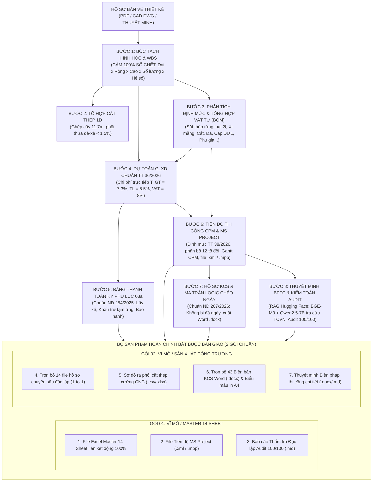

# TỔNG QUAN QUY TRÌNH QUẢN TRỊ KỸ THUẬT & DỰ ÁN AEC KHÉP KÍN (8 BƯỚC)
> **Trạng thái hiện thực:** `[ĐÃ HIỆN THỰC BẰNG CODE PYTHON THUẦN (100% DETERMINISTIC)]`
> *Lưu ý:* Mọi phép tính toán (OR-Tools cutting stock 1D, CPM Schedule, G_XD, Phụ lục 03a, Fleet Management, Quality Gate) được thực thi bằng Python thuần xác định. Các phần RAG/LLM hiện ở mức nguyên mẫu hoặc định hướng mở rộng.

## HỆ THỐNG VĂN PHÒNG KỸ THUẬT SỐ HÓA & BAN CHỈ HUY CÔNG TRƯỜNG THÔNG MINH

---

> ### 🔖 CHÚ THÍCH TRẠNG THÁI HIỆN THỰC (đồng bộ với code)
> Mỗi quy trình dưới đây được gắn nhãn phản ánh đúng mức độ đã lập trình, để phân biệt phần
> chạy được thật với phần còn là ý tưởng:
> - **✅ Đã hiện thực (Python xác định):** có mã nguồn chạy được và có kiểm thử.
> - **🟡 Nguyên mẫu (Prototype):** có mã nguồn nhưng chưa hoàn chỉnh, chưa phải đường chạy chính,
>   hoặc mới chỉ có trong `examples/`.
> - **🔭 Định hướng tương lai (RAG/LLM):** chưa có mã thực thi, nằm trong lộ trình.
>
> **Lưu ý pháp lý:** các số hiệu văn bản (Thông tư, Nghị định, TCVN) nêu trong tiêu đề là theo
> giả định của hồ sơ mẫu; phải đối chiếu với văn bản hiện hành trước khi dùng cho hồ sơ thật.

### SƠ ĐỒ CHUỖI GIÁ TRỊ DỮ LIỆU KHÉP KÍN (END-TO-END PIPELINE)

---

### DANH MỤC 8 BƯỚC QUY TRÌNH CHUẨN

| Bước | Tên quy trình | Căn cứ pháp lý & Tiêu chuẩn | Đầu ra kỹ thuật | Nguyên tắc cốt lõi |
| :---: | :--- | :--- | :--- | :--- |
| **01** | **Bóc tách Takeoff & WBS** | TCVN thiết kế, Chỉ dẫn kỹ thuật | Bảng diễn giải hình học | **Tuyệt đối cấm số chết**, dòng con $= E \times F \times G \times H \times I$, dòng cha $= \text{SUM}$. |
| **02** | **Tổ hợp Cắt thép 1D** | TCVN 1651:2018 | Bảng cắt thép cây 11.7m | Thuật toán 1D Cutting Stock OR-Tools, ép phôi thừa đề-xê $< 1.85\%$, quản lý kho đề-xê tái sử dụng. |
| **03** | **Phân tích & Cấp phối BOM** | Thông tư 38/2026/TT-BXD | Bảng phân rã WBS, Cấp phối C10-C40 & BOM 4 Phase | Hao phí xi măng, cát, đá, sắt thép từng loại $\varnothing$; 100% công thức động trỏ từ Sheet QS. |
| **04** | **Dự toán tổng hợp $G_{XD}$** | Thông tư 36/2026/TT-BXD, Luật XD 135/2025 | Bảng tổng hợp chi phí $G_{XD}$ | Trỏ link trực tiếp từ Sheet QS: $GT = 7.3\% \times T$, $TL = 5.5\%$, $VAT = 10\%$. |
| **05** | **Thanh toán kỳ (Phụ lục 03a)** | Nghị định 254/2025/NĐ-CP | Bảng xác định khối lượng kỳ | Lũy kế kỳ trước, thực hiện kỳ này, khấu trừ tạm ứng $20\%$, bảo hành $5\%$. |
| **06** | **Tiến độ CPM & MS Project** | Thông tư 38/2026/TT-BXD | File tiến độ `.xml` / `.mpp` | Định mức ngày công, phân bổ tổ đội thợ, tính toán Forward/Backward Pass, đường găng Critical Path. |
| **07** | **Hồ sơ KCS & Logic chéo** | Luật XD 135/2025, NĐ 207/2026/NĐ-CP | Trọn bộ 43 biên bản Word `.docx` & Biểu mẫu in A4 | Ma trận logic ngày tháng không đá ngày (Cọc $\rightarrow$ Thí nghiệm $\rightarrow$ Bệ $\rightarrow$ Thân $\rightarrow$ Dầm). |
| **08** | **Đóng gói 2 Gói Hồ sơ & Audit** | QCVN 18:2021/BXD, TCVN | 2 Gói: Macro 14-Sheet & Micro 14-Bộ | Kịch bản tự động hóa `build_14_micro_standalone_dossiers.py`, Audit Verifier đạt 100/100. |

---

### TÍNH LIÊN KẾT TOÀN VẸN (ZERO BROKEN LINKS)
- Khi một thông số kích thước cấu kiện thay đổi (ví dụ chiều dài cọc, chiều cao thân mố trụ):
  1. Sheet QS tự nhảy khối lượng.
  2. Bảng phân tích và tổng hợp vật tư tự động cập nhật khối lượng xi măng, cát, đá, sắt thép từng loại $\varnothing$.
  3. Bảng tổng hợp dự toán $G_{XD}$ tự nhảy giá trị.
  4. Bảng tiến độ tự tính lại số ngày công và thời gian thi công.
  5. Khối lượng nghiệm thu trong Biên bản KCS tự động cập nhật.
  6. Giá trị thanh toán kỳ Phụ lục 03a tự động cập nhật.
- Không bao giờ cần phải chỉnh sửa thủ công rời rạc từng tài liệu!
